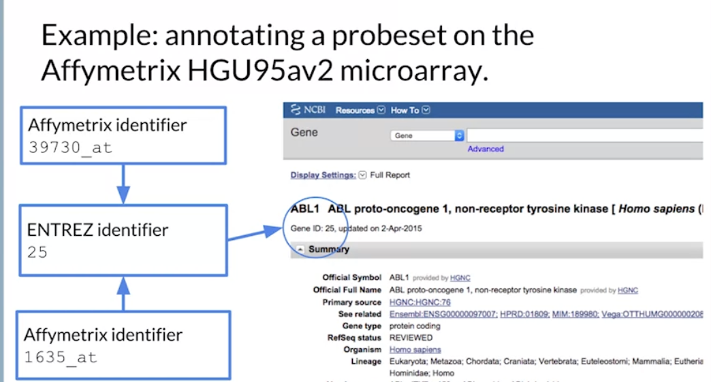

# Bioconductor

- w1:
- w2: Represent and Compute on Biological Sequences
- w3: Basic Data Types, ExpressionSet, biomaRt, and R S4

## Week 1: Introduction to Bioconductor

## Week 2: Represent and Compute on Biological Sequences

Biostrings:

DNAString, RNAString, AAString (Amino Acid String)

> dna1 = DNAString("ACGT") 

Collection of DNA strings:
> dna2 = DNAStringSet(c("ACGT", "ACGT"))

> IUAPC_CODE_MAP
A     C     G     T     M     R     W     S     Y     K     V     H     D     B     N
"A"   "C"   "G"   "T"   "AC"  "AG"  "AT"  "CG"  "CT"  "GT"  "ACG" "ACT" "AGT" "CGT" "ACGT"

> sort(dna1)
> reverse(dna1)
> reverseComplement(dna1)
> translate(dna1)
> alphabetFrequency(dna1)
> letterFrecuency(dna1, letters = "GC")
> dinucleotideFrequency(dna1)
> concensusMatrix(dna2)

BSgenome:

for representing full genomes.

> library(BSgenome.Hsapiens.UCSC.hg19)
> Scerevisiae
> seqnames(Scerevisiae)
> seqlengths(Scerevisiae)
> Scervisiae$chrI
> letterFrecuency(Scervisiae$chrI, letters = "GC")

> param = new("BSParams", alphabet = DNA_ALPHABET, k = 2)
> bsapply(param, "GC")

Biostrings - Matching:

search for a subsequence in a sequence

> dnaseq <- DNAString("ACGTACGTACGT")
> matchingPattern(dnaseq, Scerevisae$chrI)
> countPattern(dnaseq, Scerevisae$chrI)
> vmatchPattern(dnaseq, Scerevisae)

> dnaseq == reverseComplement(dnaseq)
[1] TRUE

match precision weight matrix
> matchPWM(dnaseq, pwm)
> pairWiseAlignment(dnaseq, Scerevisae$chrI)
> trimLRPatterns(dnaseq, Scerevisae$chrI)

BSgenome - Views:

a view object is a subset of a genome, under the hood is represented as a iranges object. The view only stores the start and end of the sequence, not the sequence itself, so it is memory efficient.

> vi = matchPattern(dnaseq, Scerevisae$chrI)
> ranges(vi)
> Scervisiae$chrI[57932: 57939]
> shift(vi, 10)
> resize(vi, 2)
> gr = vmatchPattern(dnaseq, Scerevisae)

> ahub = AnnotationHub()
> qh = query(ahub, c("sacCer2", "genes"))
> genes = ahub[["AH7048"]]
> prom = promoters(genes)
> prom = trim(prom)
> promViews = Views(Scerevisae, prom)
> gcProm = letterFrequency(promViews, letters = "GC", as.prob = TRUE)
> plot(density(gcProm))

GenomicRanges - Rle:

Rle is a run-length encoding, it is a compact representation of a vector with repeated values.

> rle = Rle(c(1, 1, 1, 2, 2, 3, 3, 3, 3))
> rle
numeric-Rle of length 9 with 3 runs
  Lengths: 3 2 4
  Values : 1 2 3

> ir = IRanges(start = c(2, 8), width = 4)
> aggregate(rle, ir, FUN = mean)
[1] 1.0 2.5

> slice(rle, 2:5)
> vi = Views(rle, as(GRanges("chr1", ranges = IRanges(3, 7)), "RangeList")

GenomicRanges - Lists:

a list of genomic ranges

> gr1 = GRanges("chr1", IRanges(c(1, 10), width = 5))
> gr2 = GRanges("chr1", IRanges(c(3, 15), width = 5))
> grl = GRangesList(gr1 = gr1, gr2 = gr2)
> grl[[1]]
> grl$gr1
> elementLentghs(grl)
gr1 gr2
  5   5

> sapply(grl, width)
gr1 gr2
  5   5

> shift(grl, 2)
> findOverlaps(grl, gr2)

GenomicFeatures:

The GenomicFeatures package provides functions to extract and manipulate genomic features from a genome.

> txdb = TxDb.Hsapiens.UCSC.hg19.knownGene
> genes = genes(txdb)
> gr <- GRanges(seqnames = "chr1", strand = "+", ranges = IRanges(start = 11874, end = 14409))
> subsetByOverlaps(genes, gr)
> subsetByOverlaps(transcripts(txdb), gr)
> subsetByOverlaps(exons(txdb), gr)
> subsetByOverlaps(cds(txdb), gr)
> subsetByOverlaps(cdsBy(txdb, by = "tx"), gr)

cds are the coding sequences of the genes, cdsBy are the coding sequences by transcript.

> subset(transcriptLenghts(txdb, with.cds_len=TRUE), gene_id == "100287102"))

tracklayer - Data Import

tracklayer is a package for importing and exporting data from genome browsers.

BigWIG files are binary files that store data in a compressed format. They are used to store data that is continuous and can be represented as a numeric value.

> ahub.bw = subset(ahub, rdataclass = "BigWigFile" & species == "Homo sapiens")
> bw = ahub.bw[[1]]
> bw
BigWigFile Object
resource: /Users/recorder/.AnnotationsHub/37442

> rle.gr.chr22 = import(bw, which=GRanges("chr2", ranges = IRanges(1, 10^8)), as="RLE")

a Chain File contains information about converting one specific genome to one other specific genome.

> ahub.chain = subset(ahub, rdataclass == "ChainFile")
> ahub.chain = subset(ahub.chain, species == "Homo sapiens")

> query(ahub.chain, c("hg18", "hg19"))
> chain = query(ahub.chain, c("hg18", "hg19"))[[1]]

> gr.hg18 = liftOver(gr.chr22, chain)

## Week 3: Basic Data Types, ExpressionSet, biomaRt, and R S4

Basic Data Types:

Experimental data - data collected on sequencing

Metadata (on experiment) - details of the experiment, more info about where the data comes from, on every sample (age, sex, etnicity, etc.)

Annotation - info about conservation, genes, local CpG content, etc.

Annotation Overview:

