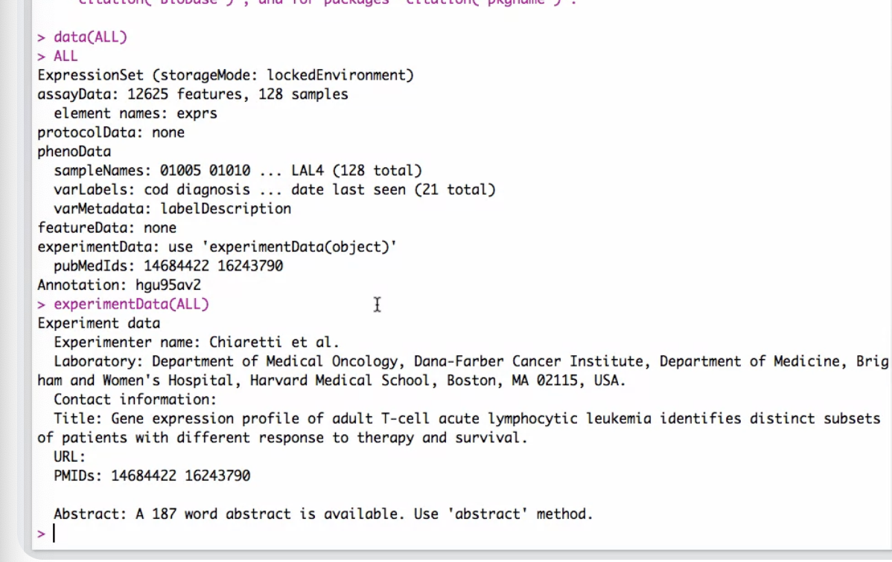
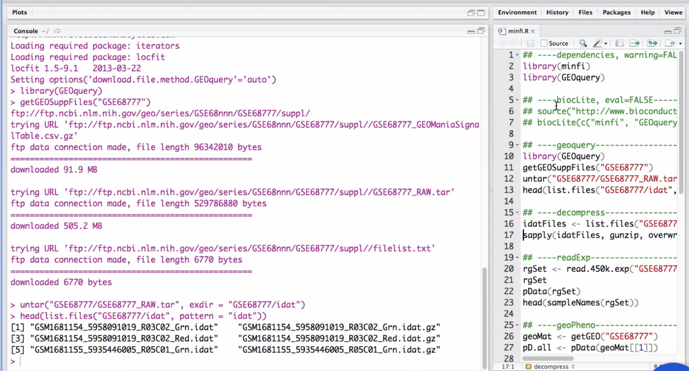

# Bioconductor

- w1:
- w2: Represent and Compute on Biological Sequences
- w3: Basic Data Types, ExpressionSet, biomaRt, and R S4
- w4: Getting data in Bioconductor, Rsamtools, oligo, limma, and minfi

## Week 1: Introduction to Bioconductor

## Week 2: Represent and Compute on Biological Sequences

Biostrings:

DNAString, RNAString, AAString (Amino Acid String)

> dna1 = DNAString("ACGT") 

Collection of DNA strings:
> dna2 = DNAStringSet(c("ACGT", "ACGT"))

> IUAPC_CODE_MAP
A     C     G     T     M     R     W     S     Y     K     V     H     D     B     N
"A"   "C"   "G"   "T"   "AC"  "AG"  "AT"  "CG"  "CT"  "GT"  "ACG" "ACT" "AGT" "CGT" "ACGT"

> sort(dna1)
> reverse(dna1)
> reverseComplement(dna1)
> translate(dna1)
> alphabetFrequency(dna1)
> letterFrecuency(dna1, letters = "GC")
> dinucleotideFrequency(dna1)
> concensusMatrix(dna2)

BSgenome:

for representing full genomes.

> library(BSgenome.Hsapiens.UCSC.hg19)
> Scerevisiae
> seqnames(Scerevisiae)
> seqlengths(Scerevisiae)
> Scervisiae$chrI
> letterFrecuency(Scervisiae$chrI, letters = "GC")

> param = new("BSParams", alphabet = DNA_ALPHABET, k = 2)
> bsapply(param, "GC")

Biostrings - Matching:

search for a subsequence in a sequence

> dnaseq <- DNAString("ACGTACGTACGT")
> matchingPattern(dnaseq, Scerevisae$chrI)
> countPattern(dnaseq, Scerevisae$chrI)
> vmatchPattern(dnaseq, Scerevisae)

> dnaseq == reverseComplement(dnaseq)
[1] TRUE

match precision weight matrix
> matchPWM(dnaseq, pwm)
> pairWiseAlignment(dnaseq, Scerevisae$chrI)
> trimLRPatterns(dnaseq, Scerevisae$chrI)

BSgenome - Views:

a view object is a subset of a genome, under the hood is represented as a iranges object. The view only stores the start and end of the sequence, not the sequence itself, so it is memory efficient.

> vi = matchPattern(dnaseq, Scerevisae$chrI)
> ranges(vi)
> Scervisiae$chrI[57932: 57939]
> shift(vi, 10)
> resize(vi, 2)
> gr = vmatchPattern(dnaseq, Scerevisae)

> ahub = AnnotationHub()
> qh = query(ahub, c("sacCer2", "genes"))
> genes = ahub[["AH7048"]]
> prom = promoters(genes)
> prom = trim(prom)
> promViews = Views(Scerevisae, prom)
> gcProm = letterFrequency(promViews, letters = "GC", as.prob = TRUE)
> plot(density(gcProm))

GenomicRanges - Rle:

Rle is a run-length encoding, it is a compact representation of a vector with repeated values.

> rle = Rle(c(1, 1, 1, 2, 2, 3, 3, 3, 3))
> rle
numeric-Rle of length 9 with 3 runs
  Lengths: 3 2 4
  Values : 1 2 3

> ir = IRanges(start = c(2, 8), width = 4)
> aggregate(rle, ir, FUN = mean)
[1] 1.0 2.5

> slice(rle, 2:5)
> vi = Views(rle, as(GRanges("chr1", ranges = IRanges(3, 7)), "RangeList")

GenomicRanges - Lists:

a list of genomic ranges

> gr1 = GRanges("chr1", IRanges(c(1, 10), width = 5))
> gr2 = GRanges("chr1", IRanges(c(3, 15), width = 5))
> grl = GRangesList(gr1 = gr1, gr2 = gr2)
> grl[[1]]
> grl$gr1
> elementLentghs(grl)
gr1 gr2
  5   5

> sapply(grl, width)
gr1 gr2
  5   5

> shift(grl, 2)
> findOverlaps(grl, gr2)

GenomicFeatures:

The GenomicFeatures package provides functions to extract and manipulate genomic features from a genome.

> txdb = TxDb.Hsapiens.UCSC.hg19.knownGene
> genes = genes(txdb)
> gr <- GRanges(seqnames = "chr1", strand = "+", ranges = IRanges(start = 11874, end = 14409))
> subsetByOverlaps(genes, gr)
> subsetByOverlaps(transcripts(txdb), gr)
> subsetByOverlaps(exons(txdb), gr)
> subsetByOverlaps(cds(txdb), gr)
> subsetByOverlaps(cdsBy(txdb, by = "tx"), gr)

cds are the coding sequences of the genes, cdsBy are the coding sequences by transcript.

> subset(transcriptLenghts(txdb, with.cds_len=TRUE), gene_id == "100287102"))

tracklayer - Data Import

tracklayer is a package for importing and exporting data from genome browsers.

BigWIG files are binary files that store data in a compressed format. They are used to store data that is continuous and can be represented as a numeric value.

> ahub.bw = subset(ahub, rdataclass = "BigWigFile" & species == "Homo sapiens")
> bw = ahub.bw[[1]]
> bw
BigWigFile Object
resource: /Users/recorder/.AnnotationsHub/37442

> rle.gr.chr22 = import(bw, which=GRanges("chr2", ranges = IRanges(1, 10^8)), as="RLE")

a Chain File contains information about converting one specific genome to one other specific genome.

> ahub.chain = subset(ahub, rdataclass == "ChainFile")
> ahub.chain = subset(ahub.chain, species == "Homo sapiens")

> query(ahub.chain, c("hg18", "hg19"))
> chain = query(ahub.chain, c("hg18", "hg19"))[[1]]

> gr.hg18 = liftOver(gr.chr22, chain)

## Week 3: Basic Data Types, ExpressionSet, biomaRt, and R S4

Basic Data Types:

Experimental data - data collected on sequencing

Metadata (on experiment) - details of the experiment, more info about where the data comes from, on every sample (age, sex, etnicity, etc.)

Annotation - info about conservation, genes, local CpG content, etc.

Annotation Overview:

ExpressionSet

> ALL

> experimentData(ALL)

> exprs(ALL)[1:4, 1:4]

pData has info about samples (p of phenotype)
> pData(ALL)

featuresData contains info about features
> featuresData(ALL)

phenoData contains info about phenotypes
> phenoData(ALL)

SummarizedExperiment:

airway is a SummarizedExperiment object that contains RNA-seq data from a study of asthma. It contains the expression levels of 500 genes in 8 samples.

> library(airway)

each row is a gene, each column is a sample
each GRange is an exon

GEOquery:

the Gene Expression Omnibus (GEO) database. it not only contains gene expression data, but also other types of data.

> elist = getGEO("GSE24460")

biomaRt:

an interface package to the BioMart database. BioMart is a database that contains a lot of information about genes and proteins.

> library(biomaRt)

a mart is a database and it contains multiple datasets.

> mart <- useMart("ensembl")

> ensembl <- useDataset("hsapiens_gene_ensembl", mart)
> values <- c("ENSG00000157764", "ENSG00000169174", "ENSG00000169174")
> getBM(attributes = c("ensembl_gene_id", "external_gene_id", "description"), filters = "ensembl_gene_id", values = values, mart = ensembl)

> attributes <- listAttributes(ensembl)

R S4 Classes:

s4 classes are a way to define classes in R. they are more flexible than s3 classes.

> library(ALL)
> library(GenomicRanges)

> df <- data.frame(y = rnomr(10), x = rnorm(10))

lm is a function that fits a linear model to a dataset
> lm.object <- lm(y ~ x, data = df)
> class(lm.object)
[1] "lm"

> class?ExpressionSet
> ?"ExpressionSet-class"
> getClass("ExpressionSet")

R S4 Methods:

> library(GenomicRanges)

> getMethod("as.data.frame", signature(x="GenomicRanges"))

> method?"as.data.frame,DataFrame"
> ?"as.data.frame,DataFrame-method"

## Week 4: Getting data in Bioconductor, Rsamtools, oligo, limma, and minfi

Getting Data into Bioconductor:

- microarrays: CEL (Affymetrix), IDAT (Illumina), GPR (GenePix), TXT (Agilent)

- high-throughput sequencing: FASTQ (raw), BAM/SAM (), BED, WIG, BIGWIF, GFF, GTF, VCF, UCSC
read.table(), read_tsv(), reac_csv(), read_delim()

Short Read:

The ShortRead package contains two different functionalities for reading in raw sequencing reads. Typically in the form of a so called FastqFile. It also contains a functionality for reading in aligned reads. Although a lot of that functionality is now outdated and you should be using the Rsam 2 packets instead.

> library(ShortRead)

Rsamtools:

The Rsam tools package is a library for interface which is something called a SAM tools library. This is laid up and replaced by something called HGS or high sequencing library. This is a set of collections for dealing with files in SAM and BAM format. SAM is a text file format for representing aligned reads. BAM is a binary version of SAM, and for all practical purposes, because they are fast and more convenient, everybody should exclusively work with BAM files.

> library(Rsamtools)

> bamPath <- system.file("extdata", "ex1.bam", package = "Rsamtools")
> bamPath
> bamFile <- BamFile(bamPath)
> bamFile
> seqinfo(bamFile)

> aln <- scanBam(bamFile)
> length(aln)

> quickBamFlagSummary(bamFile)

oligo:

A package for pre-processing and handling Affymetrix and nimble chimp micro rays. Specifically gene expression micro rays and snip micro rays. So Affymetrix chips, so called single column microarrays. They are widely used, an early success of the Bioconductor project was to provide a very good method for pre-processing and analyzing gene expression erased from Affymetrix. This package is a continuation or a second version of an earlier package in Bioconductor called the Affy package. The Affy package was specifically focused on gene expression, micro-rays from Affymetrix, and then later on, the authors realized that they could handle gene expression and snip chips, and also for both Affymetrix and Nimble Jim.

> library(oligo)
> library(Geoquery)

limma:

it is a package for analyzing gene expression data. It is a very popular package in Bioconductor.
It is used for differential expression analysis, and it is used for analyzing gene expression data from microarrays and high-throughput sequencing.

Model gene expression and the variance of the gene, helps to extract more signal from less samples.

Design of Experiment explains how the samples were collected, and how the experiment was designed.

> library(limma)
> library(leukemiasEset)

minfi:

it is a package for analyzing methylation data. It is used for analyzing methylation data from microarrays.

> library(minfi)
> library(GEOquery)

Count-based RNA-seq analysis:

> library(DESeq2)
> library(edgeR)

> library(airway)

Count-based rna analysis is a way to analyze rna-seq data by counting the number of reads that map to a gene.

