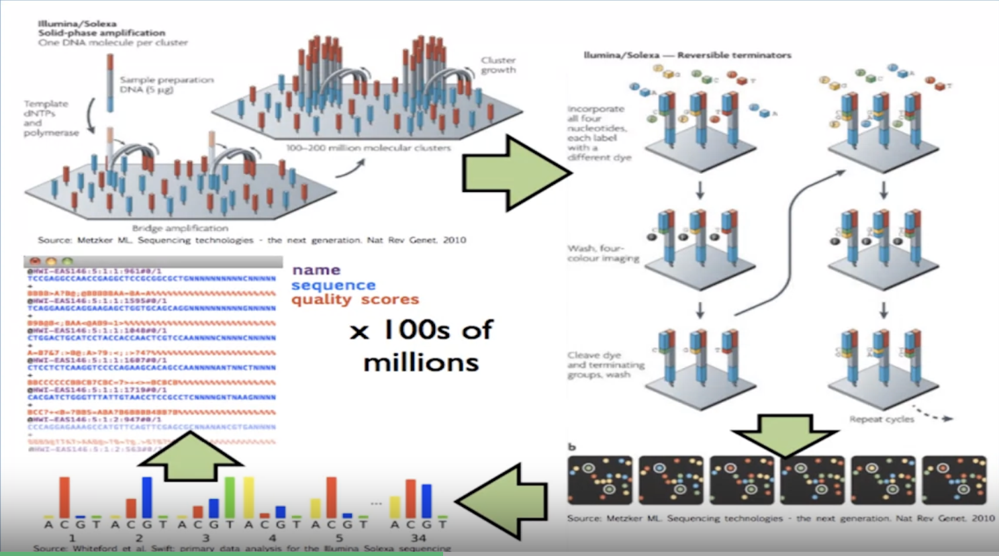
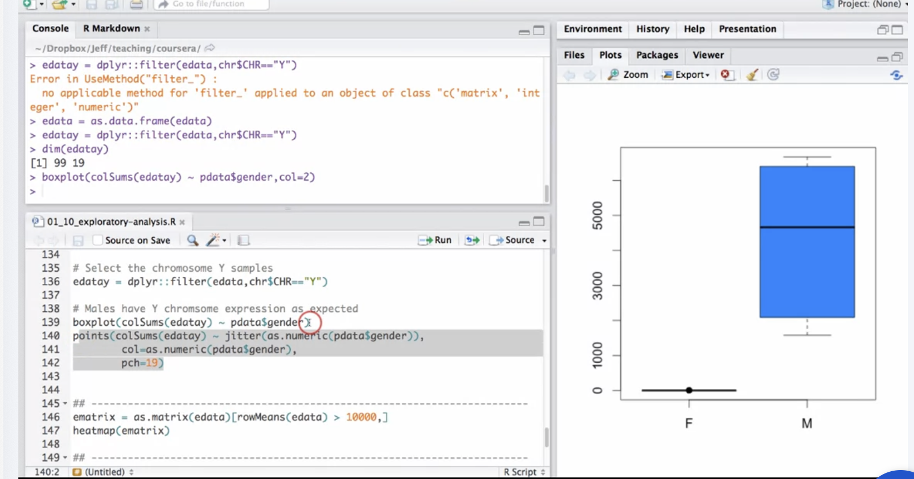
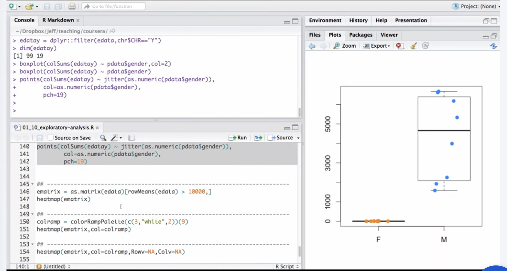
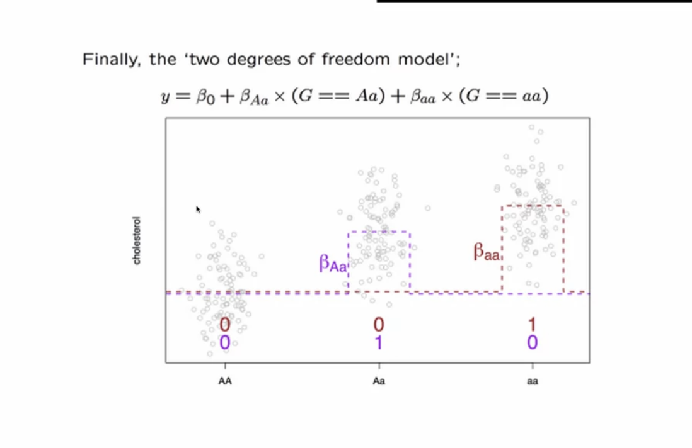
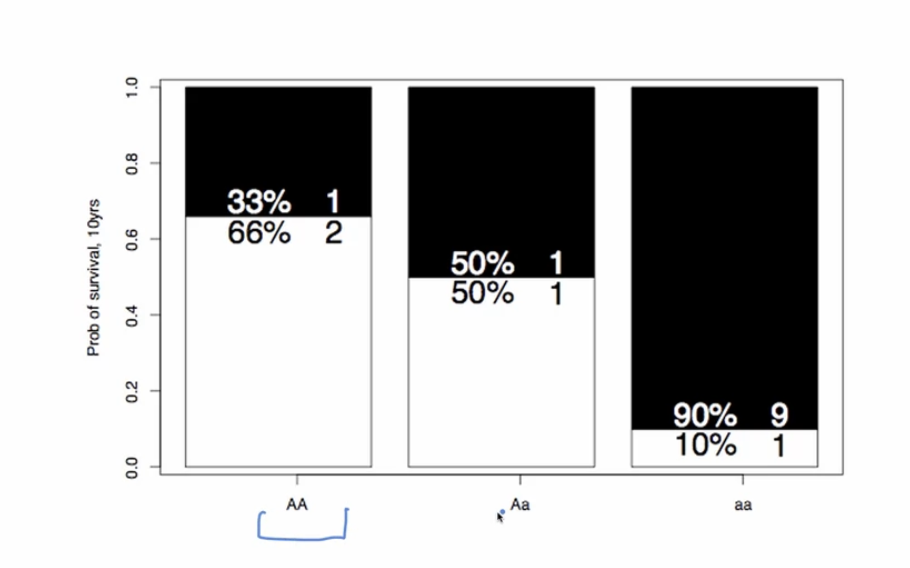
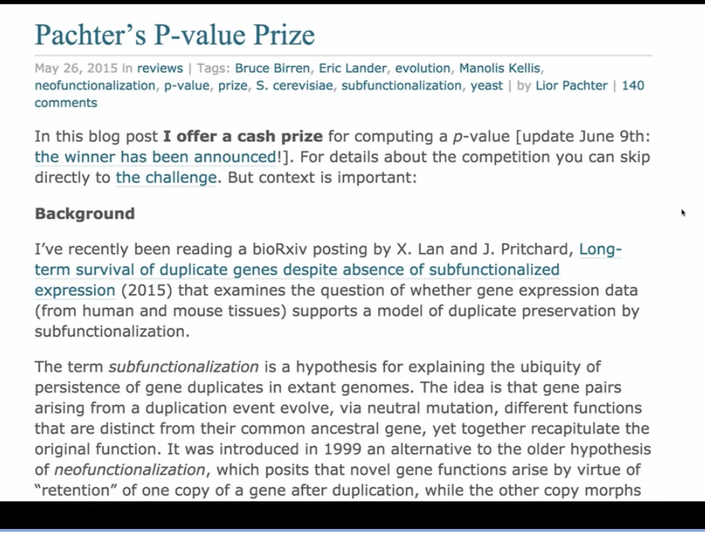

# Statistics for Genomic Data Science

1- Exploratory Data Analysis (EDA), Linear Modeling, and Testing / Multiple Testing
2- Preprocessing, Linear Modeling, and batch effects.
3- Modeling Non-continuous Outcomes, Hypothesis Testing, and Multiple Hypothesis Testing
4- General Pipelines for Genomic Data Analysis

## 1- Exploratory Data Analysis (EDA), Linear Modeling, and Testing / Multiple Testing

"Statistics is the science of learning generalizable knowledge from data."

Sources of statistics packages and tools: blogs, github, cran, bioconductor, etc.

"Data are values of qualitative or quantitative variables, belonging to a set of items."

Raw data = no computations
Processed data = final, tidy dataset

Reproducible Research:

Reproducible research means that you can take someone's data and their code, rerun it and get the same answer exactly the same every time that that code and data are run. 

Achieving Reproducibility:

R Markdown:

The Three Tables in Genomics:

Experimental Design - Variability, Replication, and Power:

Experimental Design - Confounding and Randomization:

Exploratory Analysis:

in R:

Data Transforms:

Clustering:

Hierrarchichal Clustering

K-means Clustering

in R:

Study Reproducibility vs Replicability:

- Reproducibility: The ability to reanalyze the same data and methods from the study and get the same results.

- Replicability: The ability to conduct a new study that is similar to the original study but with new data and maybe new similar methods and get the same results.

## 2- Preprocessing, Linear Modeling, and batch effects.

Quantile normalization example

Dimension Reduction:

in R:

Pre-processing and Normalization

Quanitle Normalization (in R):

The Linear Model:

Linear Models with Categorical Covariates:

Adjusting for Covariates:

Linear Regression in R:

Many Regressions Simultaneously:

in R:

Batch Effects and Confounders:

Surrogate Variable Analysis (SVA) is a method to identify and estimate hidden sources of variation in high-dimensional data sets. It can be used to identify and adjust for confounding factors in high-dimensional data sets, such as those from microarray or RNA-seq experiments.

Batch Effects in R:

## 3- Modeling Non-continuous Outcomes, Hypothesis Testing, and Multiple Hypothesis Testing

Logistic Regression:

Regression for Counts:

GLMs in R:

Inference:

Null and Alternative Hypotheses:

Calculating statistics:

Comparing Models:

Calculating Statistics in R:

