## Overview

### Why Genomics?

DNA -> (transcription) -> RNA -> (translation) -> Protein -> (proteins can also be used to regulate gene expression) -> Methylation

Each triplet produces an amino acid.

20 possible amino acids to produce proteins, the tipical protein has 300-400 amino acids.

In 2001, the human genome project was completed. It was a 13 year project that cost $3 billion. It was the first time that the entire human genome was sequenced.

The human genome has 3.1 billion base pairs.

The human genome contains 20,000 protein coding genes.

NCBI: National Center for Biotechnology Information (largest database of genomic information).

### What is Genomics?

The branch of molecular biology concerned with the structure, function, evolution, and mapping of genomes. 

The human genome there is approximately 3.1 billion base pairs divided into 23 chromosomes.

### What is Genomic Data Science?

Biology - Statistics - Computer Science

Aligment and Assembly / Preprocessing and Normalization / Statistics and ML / Sw dev / Population genomics / Integrative genomics

## Molecular Biology

### Just enough cell biology

Bacteria / Archaea / Eukaryota

Prokariotes (don't have cell nucleus) / Eukariotes (have cell nucleus)

Mitochondria and chloroplasts have their own DNA.

The Cell Cycle (Animal Cells):  
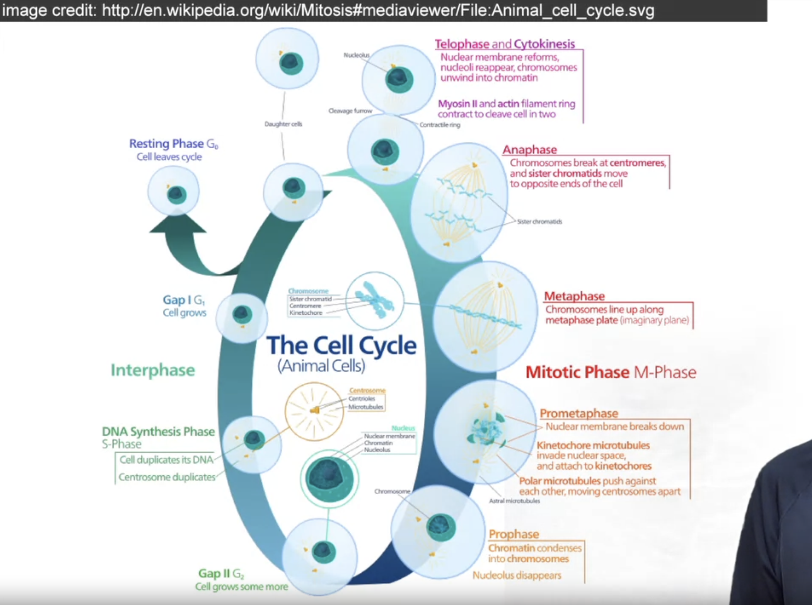
1 - Telophase and Cytokinesis 
2 - Anaphase
3 - Metaphase
4 - Prometaphase
5 - Prophase
6 - Gap II
7 - DNA Synthesis Phase
8 - Gap I
X - Resting Phase (Cell leaves cycle)

Multipotential stem cells can differentiate into multiple cell types.

Meiosis: Recombination of genetic material between homologous chromosomes.

### Important Molecules in Molecular Biology

DNA is comprised of 4 different nucleotides:
Purines: 
- Adenine (A)
- Guanine (G)

Pyrimidines:
- Thymine (T)
- Cytosine (C)

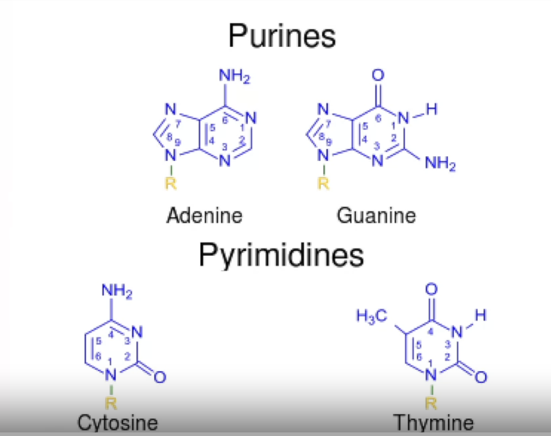
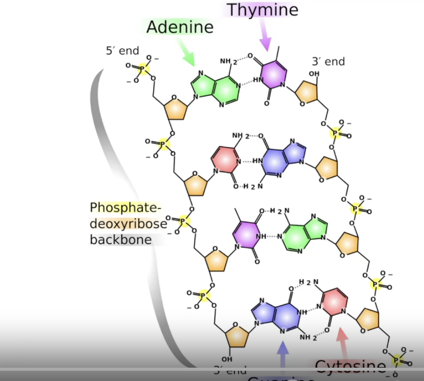
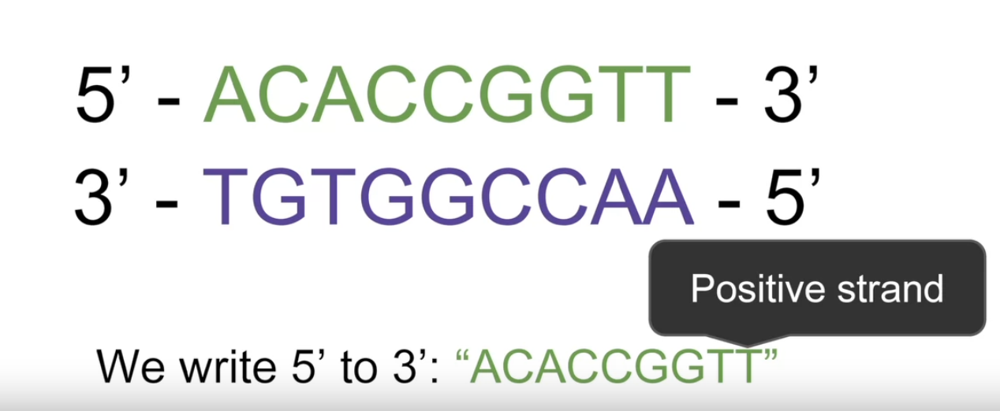

Positive strand: 5' -> 3'
Reverse or negative strand: 3' -> 5'

RNA is similar to DNA but has Uracil (U) instead of Thymine (T) and it has a single strand.

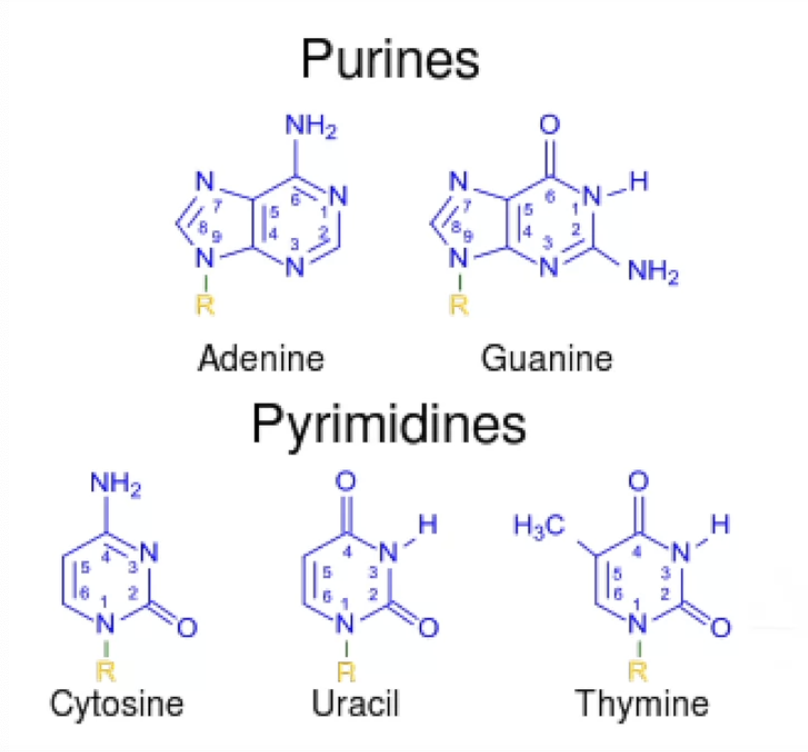

RNA is used to produce proteins. The process is called transcription.

Aminoacids are more complex molecules that are used to build proteins.

Every 3 nucleotides in the RNA sequence is called a codon or triplet. Each codon codes for a specific amino acid. 

There are 64 possible codons (4^3). That encode 20 aminoacids while 3 of them are stop codons and 1 is the start codon.

### The Human Genome Project

Proposed in 1987 by the US Department of Energy. It officially started in 1989 in a joint effort between the US Department of Energy and the National Institutes of Health.

Goals: Sequence 3 billion basepairs for 1$ per basepair by 2005.

In 1995 TIGR sequenced the first complete genome of a free-living organism, Haemophilus influenzae. 1.8 million basepairs and 1742 genes.

Genes are transcripted into RNA but not all RNA is translated into proteins, some RNA has other functions like tRNA and rRNA.

### Molecular Biology Structures

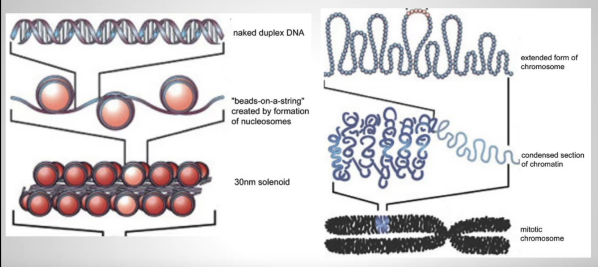

DNA is around 2m long.   
It is wrapped around histones to form nucleosomes.  
Nucleosomes are wrapped around each other to form chromatin.  
Chromatin is further condensed to form chromosomes.

Tandem repeats: Repeated sequences of DNA that are adjacent to each other.

Interspersed repeats: Repeated sequences of DNA that are not adjacent to each other.

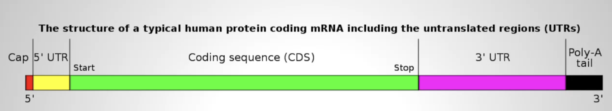

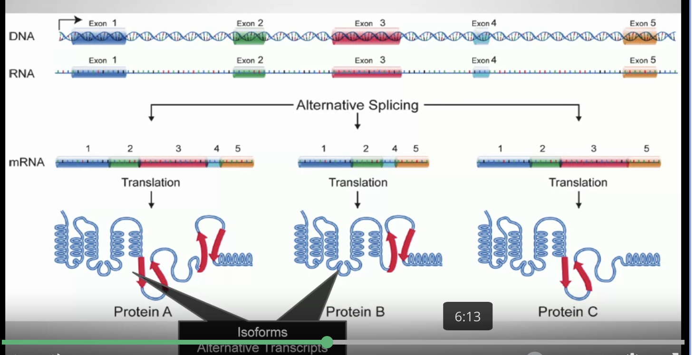

An Exon is a coding region of a gene. An Intron is a non-coding region of a gene.

Aminoacids form primary and secondary structures that fold into tertiary structures that form quaternary structures.

Primary structure: aminoacid sequence
Secondary structure: regular sub-structures (alpha helix or beta sheet)
Tertiary structure: 3D structure of the protein
Quaternary structure: multiple proteins interacting with each other

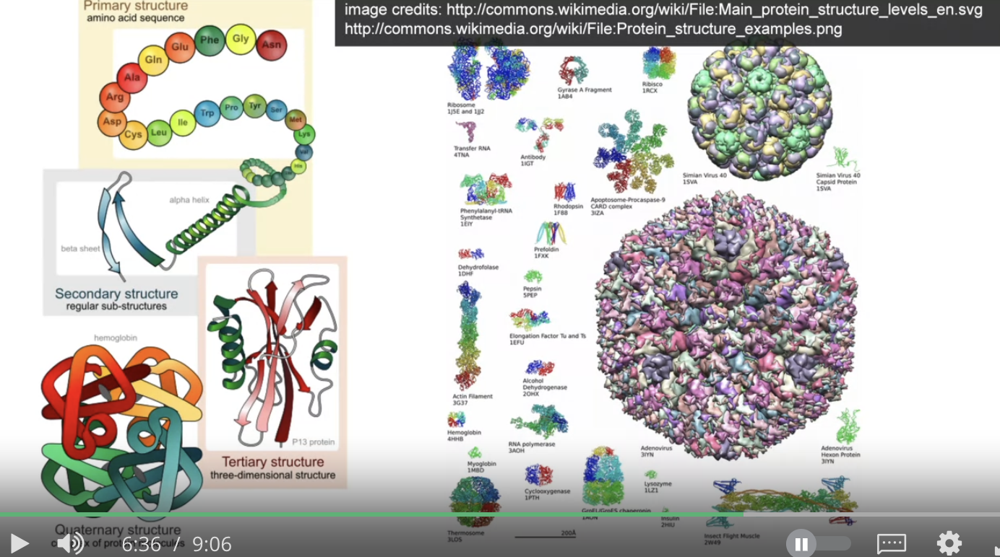

Transcription factors: Proteins that bind to DNA and regulate gene expression.

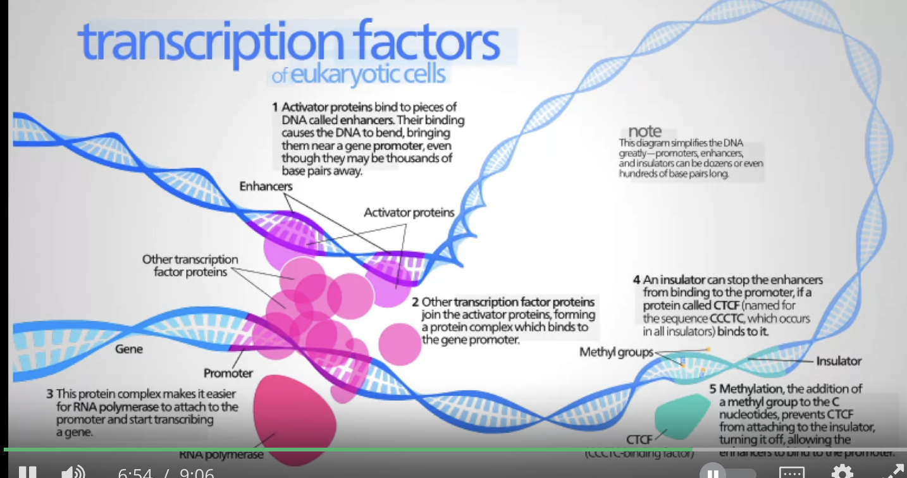

Epigenetics: beyond genetics, factors that control how genes are expressed. 

Methylation: adding a methyl group to DNA can turn off gene expression.

### From Genes to Phenotypes

Genotype: the sequences of your genes and their mutations that you have inherited. 

Phenotype: the physical characteristics that result from your genotype.

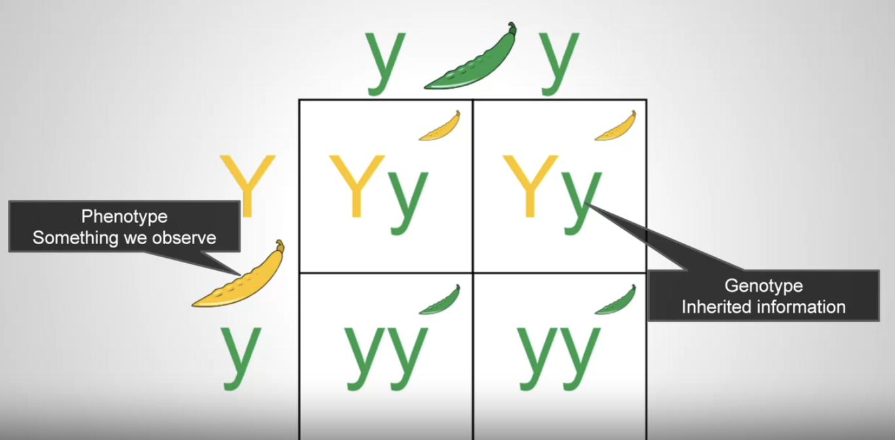

Recesive alleles or traits: need two copies to be expressed.  
Dominant alleles or traits: need only one copy to be expressed.  

